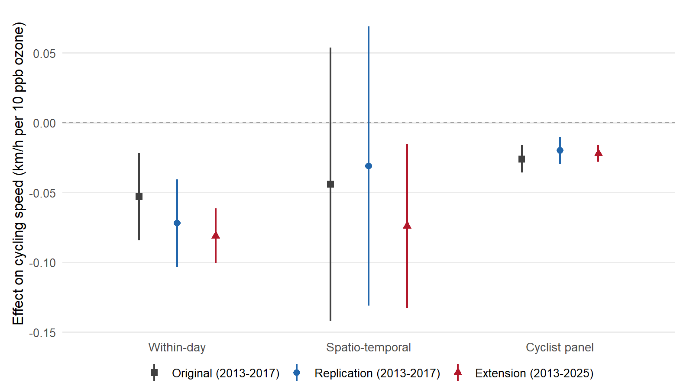
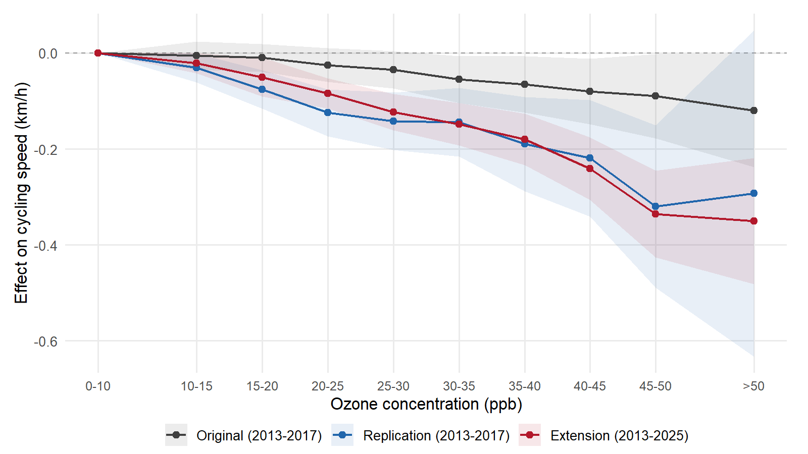

# Urban Air Pollution and Time Losses: Evidence from Cyclists in London — Revisited

Replication and extension of [Klingen & van Ommeren (2020)](https://doi.org/10.1016/j.regsciurbeco.2019.103504), *Regional Science and Urban Economics*.

## Paper

> Klingen, J. and van Ommeren, J.N. (2020). Air pollution and physical effort: Evidence from cyclists in London. *Regional Science and Urban Economics*, 81, 103504.

**Abstract.** We replicate and extend Klingen & van Ommeren (2020), who found that a 10 ppb increase in ozone reduces cycling speed by 0.3--0.4% using 42 million London bike-share trips (2013--2017). Extending the sample to 108 million trips through 2025, we confirm a negative ozone--speed relationship across all four identification strategies (within-day, between-day, spatio-temporal, cyclist panel). Point estimates in the extended and post-2017 samples are at least as large as in the original period, indicating that the effect has not diminished despite substantial changes in London's air quality and cycling landscape---including COVID-19, the Ultra Low Emission Zone expansion, and major cycling infrastructure investments.

## Results

Three identification strategies --- exploiting within-day, spatio-temporal, and within-cyclist variation --- consistently show that ozone reduces cycling speed. The table below compares the original estimates to our replication and the extended sample.

**Effect of ozone on cycling speed (km/h per 10 ppb)**

| Identification strategy | Original (2013--2017) | Replication (2013--2017) | Extension (2013--2025) |
|---|:---:|:---:|:---:|
| Within-day | -0.053\*\*\* | -0.072\*\*\* | -0.081\*\*\* |
| Spatio-temporal | -0.044 | -0.031 | -0.074\*\* |
| Cyclist panel | -0.026\*\*\* | -0.020\*\*\* | -0.022\*\*\* |

\*\*\* p<0.01, \*\* p<0.05

<p align="center">
  
</p>

The core finding is confirmed: a 10 ppb increase in ozone reduces average cycling speed by 0.02--0.08 km/h, depending on the identification strategy. Estimates from the extended sample are broadly consistent with the original, and the panel estimates --- which control for individual cyclist heterogeneity --- are particularly stable across time periods.

The between-day strategy is omitted from this comparison because it relies on car traffic controls from automatic traffic counters that are no longer publicly available. Without these controls, the between-day replication produces a substantially larger coefficient (-0.276 vs. the original -0.083), likely reflecting omitted variable bias from traffic congestion. The within-day and panel strategies are less affected because day fixed effects and cyclist fixed effects, respectively, absorb most traffic-related confounding.

The figure below shows the non-linear ozone--speed relationship using 5 ppb ozone bin indicators. All three series display a roughly linear decline, with effects becoming visible around 15--20 ppb --- consistent with the original finding that the threshold is well below regulatory standards. The original coefficients are from the cyclist panel specification; the replication and extension use the within-day specification, which yields larger point estimates.

<p align="center">
  
</p>

## Data

The analysis uses three data sources:

- **Cycling trips**: Transport for London (TfL) Santander Cycles, available from the [TfL cycling data portal](https://cycling.data.tfl.gov.uk/)
- **Air quality**: London Air Quality Network, hourly data from 5 monitoring stations (BL0, KC1, RI2, SK6, TH4), via the [Imperial College API](https://www.londonair.org.uk/LondonAir/API/)
- **Weather**: [Open-Meteo Archive API](https://open-meteo.com/en/docs/historical-weather-api), central London (51.52N, 0.11W)

Raw data files are too large for this repository (~15 GB). The download scripts (`R/01_*` through `R/03_*`) retrieve all data from the sources above.

## Replication

### Requirements

R 4.3+ with the following packages: `data.table`, `arrow`, `fixest`, `ggplot2`, `lubridate`, `suncalc`, `sf`, `jsonlite`, `curl`, `gridExtra`. These are installed automatically by `R/00_packages.R`.

### Running the analysis

Scripts are numbered in order of execution. From the project root:

```bash
# Download data (requires internet; ~2 hours)
Rscript R/01_download_cycling.R
Rscript R/01b_fix_bad_cycling.R
Rscript R/01c_expand_stations.R
Rscript R/02_download_airquality.R
Rscript R/02b_download_airquality_extended.R
Rscript R/03_download_weather.R
Rscript R/03b_download_weather_extended.R

# Clean and merge (~30 minutes)
Rscript R/04_clean_cycling.R
Rscript R/05_clean_environment.R
Rscript R/06_merge.R

# Estimation (~20 minutes; panel is slow)
Rscript R/07_descriptives.R
Rscript R/08_within_day.R
Rscript R/09_between_day.R
Rscript R/10_spatiotemporal.R
Rscript R/11a_panel_build.R
Rscript R/11b_panel_estimate.R
Rscript R/12_robustness.R
Rscript R/13_comparison_figure.R
Rscript R/14_nonlinearity_figure.R
```

Results are written to `output/tables/` and `output/figures/`.

## Repository structure

```
R/                  Analysis scripts (numbered in execution order)
data/               Raw and processed data (not tracked, too large)
output/
  figures/          Figures (PDF + PNG)
  tables/           Regression tables (LaTeX + CSV)
tex/                Paper manuscript and references
```

## License

[GPL-2.0](LICENSE)
